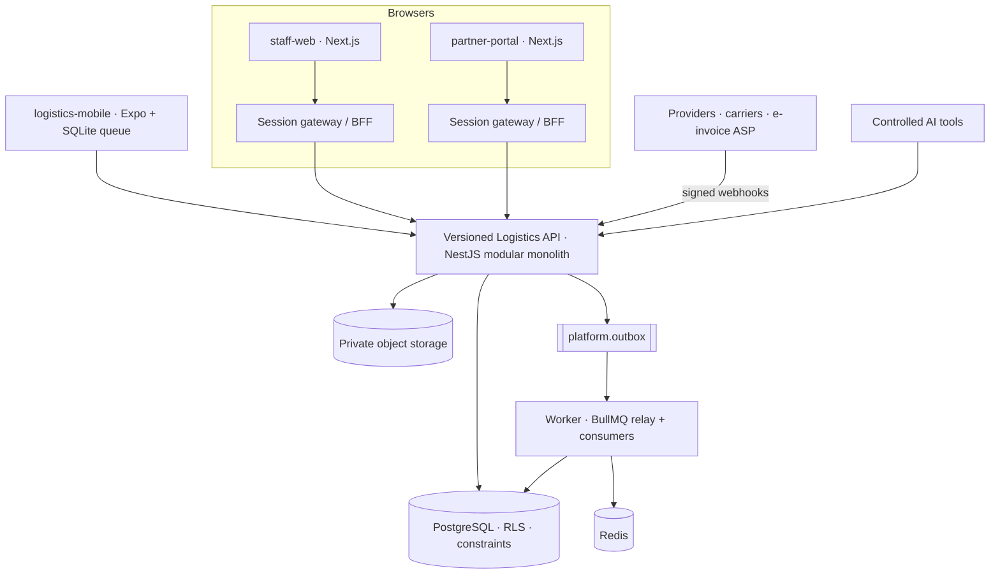

# DigitalBurj Logistics OS — architecture overview

## Principles (each one is enforced by a test or a database constraint)
1. **The database is the source of truth.** Dashboards, queues and AI are derived. Money = `numeric(18,4)`, JSON strings on the wire, `decimal.js` in code, half-up rounding **per line**.
2. **Tenancy is defence-in-depth:** application scoping + composite FKs + PostgreSQL RLS (forced) + a runtime role that cannot bypass it. The worker is tenant-bound too, except for claiming outbox/inbox rows.
3. **State changes are commands**, never generic updates: validate state → authorise (permission + scope) → check evidence → write → audit → outbox, in one transaction.
4. **Idempotent by construction:** `Idempotency-Key` (stored with the effect), natural keys (`source_event_key`, `command_key`, `allocation_key`, `external_event_id`), `UNIQUE` constraints as the last line.
5. **Evidence over assertion:** estimated ≠ actual (CHECK), authority status ≠ internal status, "released" requires an approved authority document, delivery requires an approved + scanned POD.
6. **Maker-checker** is identity-based at runtime and mirrored by CHECK constraints.
7. **AI is a client of the same services** — it inherits the caller's permissions, high-risk actions only create approval requests, usage is metered per tenant.

## Module map (`apps/api/src`)
`platform` (config, db/uow, auth guard, errors, storage) · `identity` · `organizations` · `parties` · `commercial` · `logistics` · `transport` · `warehouse` · `trade` · `finance` · `documents` · `collaboration` · `automation` · `intelligence` · `integrations`. Cross-module calls go through each module's `index.ts` only (CI-enforced). Each substantial module is split `domain/` (pure rules, unit-tested) · `application/` (use cases + SQL) · `presentation/` (controllers bound to the contract via `@Op`).

## Request path
`Browser → BFF (cookie → bearer + X-Tenant-Id, CSRF check) → OpGuard (verify JWT → resolve user → membership → permissions → idempotency/If-Match → Zod body) → controller → use case → Db.run(ctx) { SET LOCAL app.tenant_id; … } → JSON`. Error bodies: `{ code, message, requestId, details? }`.

## Environments & secrets
Local (docker-compose or `infrastructure/local/pg-local.sh`), preview, staging, production. Public config = URLs only. Server secrets come from the secrets manager; tenant integrations reference encrypted connection rows (`credential_ref`), never env vars. Production refuses `DEV_AUTH_SECRET` (config test).
