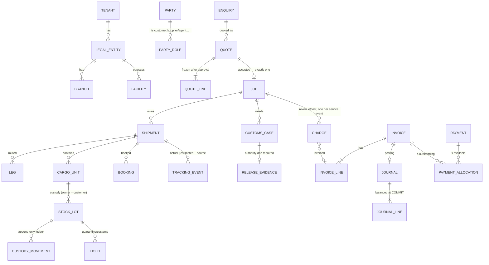

# Domain model

**Customer order → Job → Shipment → Leg / Cargo → Booking / Tracking / Customs / Charges → Invoice → Journal → Cash.** A job owns commercial responsibility and profitability; shipments carry execution; stock lots carry custody; charges carry money. Documents link polymorphically (`related_type`, `related_id`) to the record they evidence.

Identity separation: tenant ≠ legal entity ≠ branch ≠ facility ≠ party ≠ user ≠ membership (`platform`, `org`, `parties` schemas). Branch kinds distinguish `operated_office` from `agent_office`; intercompany and partner-agent settlement are modelled as supplier/customer relationships, never as branches.

Schemas: `platform org parties commercial logistics transport warehouse trade finance collab automation integ ref`.
